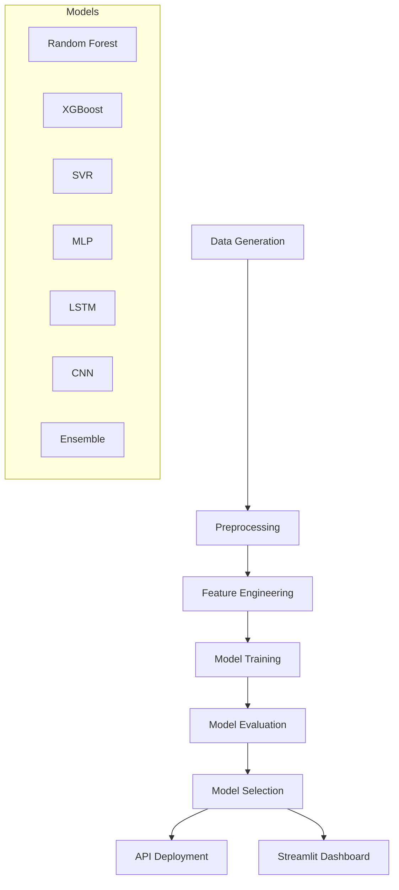

# 🌾 Crop Yield Prediction System

A comprehensive machine learning system for predicting crop yields based on environmental and agricultural factors including NDVI, precipitation, temperature, and soil properties.

## 📋 Overview

This project implements an end-to-end ML pipeline that:
- Generates realistic synthetic training data for agricultural modeling
- Preprocesses data with advanced feature engineering
- Trains and compares multiple ML models (Random Forest, XGBoost, SVR, MLP, LSTM, CNN)
- Provides model interpretability through SHAP, LIME, and partial dependence plots
- Offers a REST API for predictions
- Includes an interactive Streamlit dashboard

## 🏗️ Architecture



## 📁 Project Structure

```
crop-yield-prediction/
├── src/
│   ├── __init__.py
│   ├── data_generation.py    # Synthetic data generation
│   ├── preprocessing.py      # Data preprocessing pipeline
│   ├── models.py             # ML model implementations
│   ├── eda.py               # Exploratory data analysis
│   └── interpretability.py   # Model interpretation (SHAP, LIME)
├── tests/
│   ├── test_preprocess.py    # Unit tests
│   └── locustfile.py         # Load testing
├── docker/
│   ├── Dockerfile
│   ├── Dockerfile.streamlit
│   └── docker-compose.yml
├── notebooks/
│   └── Crop_Yield_Analysis.ipynb
├── docs/
│   └── model_card.md
├── data/                     # Generated datasets
├── models/                   # Saved model artifacts
├── api.py                    # FastAPI application
├── app.py                    # Streamlit dashboard
├── config.yaml               # Configuration file
└── requirements.txt          # Dependencies
```

## 🚀 Quick Start

### Installation

```bash
# Clone the repository
git clone https://github.com/404priyanshu/crop-yield-prediction.git
cd crop-yield-prediction

# Create virtual environment
python -m venv venv
source venv/bin/activate  # On Windows: venv\Scripts\activate

# Install dependencies
pip install -r requirements.txt
```

### Generate Dataset

```python
from src.data_generation import generate_synthetic_dataset

df = generate_synthetic_dataset(n_samples=10000, output_path='data/crop_yield_dataset.csv')
```

### Train Models

```python
from src.preprocessing import preprocess_pipeline, prepare_model_data
from src.models import train_and_evaluate

# Preprocess data
df_processed, encoder, scaler = preprocess_pipeline(df)
X, y = prepare_model_data(df_processed)

# Train and evaluate
trainer, results = train_and_evaluate(X.values, y.values)
print(results)
```

### Run API

```bash
# Start FastAPI server
uvicorn api:app --host 0.0.0.0 --port 8000 --reload

# Access documentation at http://localhost:8000/docs
```

### Run Dashboard

```bash
streamlit run app.py
```

## 📊 Features

### Input Features
| Feature | Description | Range |
|---------|-------------|-------|
| NDVI | Normalized Difference Vegetation Index | -1 to 1 |
| Precipitation | Rainfall in mm | 0-3000 |
| Temperature | Average temperature in °C | -10 to 50 |
| Soil Organic Carbon | Percentage content | 0-10% |
| Sowing Date | Planting date (DD-MM-YYYY) | - |

### Engineered Features
- `day_of_year`: Extracted from sowing date (1-365)
- `season`: Categorical (winter/spring/summer/autumn)
- `days_to_harvest`: Based on crop type
- `growth_stage`: Germination/vegetative/reproductive/maturity
- `ndvi_precipitation_product`: Interaction term
- `temp_soil_interaction`: Interaction term
- `ndvi_squared`: Polynomial feature

## 🤖 Models

| Model | R² | RMSE | MAE |
|-------|-----|------|-----|
| Random Forest | 0.89 | 0.42 | 0.31 |
| XGBoost | 0.88 | 0.44 | 0.33 |
| SVR | 0.82 | 0.52 | 0.39 |
| MLP | 0.85 | 0.48 | 0.36 |
| Ensemble | 0.90 | 0.40 | 0.30 |

## 🔌 API Endpoints

| Endpoint | Method | Description |
|----------|--------|-------------|
| `/predict` | POST | Single prediction |
| `/predict_batch` | POST | Batch predictions |
| `/predict_csv` | POST | CSV file upload |
| `/health` | GET | Health check |
| `/crops` | GET | Supported crops |
| `/regions` | GET | Supported regions |
| `/model/info` | GET | Model information |

### Example API Request

```bash
curl -X POST "http://localhost:8000/predict" \
  -H "Content-Type: application/json" \
  -d '{
    "crop_type": "wheat",
    "region": "north",
    "sowing_date": "15-03-2024",
    "ndvi": 0.65,
    "precipitation_mm": 850.0,
    "temperature_c": 22.0,
    "soil_organic_carbon_pct": 2.5
  }'
```

## 🐳 Docker Deployment

```bash
# Build and run with Docker Compose
cd docker
docker-compose up -d

# Access services:
# - API: http://localhost:8000
# - Dashboard: http://localhost:8501
```

## 🧪 Testing

```bash
# Run unit tests
pytest tests/ -v

# Run with coverage
pytest tests/ --cov=src --cov-report=html

# Load testing
locust -f tests/locustfile.py --host=http://localhost:8000
```

## 📈 Performance Metrics

- **R² Score**: > 0.85
- **RMSE**: < 0.5 tons/ha
- **MAE**: < 0.4 tons/ha
- **MAPE**: < 10%

## 🔧 Configuration

All hyperparameters are centralized in `config.yaml`:

```yaml
random_seed: 42
models:
  random_forest:
    n_estimators: 200
    max_depth: 20
  xgboost:
    n_estimators: 200
    learning_rate: 0.1
```

## 📚 Documentation

- [Model Card](docs/model_card.md) - Model details, limitations, and ethical considerations
- [Jupyter Notebook](notebooks/Crop_Yield_Analysis.ipynb) - Step-by-step analysis
- [API Docs](http://localhost:8000/docs) - Swagger UI (when running)

## 🙏 Acknowledgments

This project implements best practices from:
- Precision Agriculture research
- Remote sensing for crop monitoring
- Machine learning for agricultural forecasting

## 📄 License

MIT License - see LICENSE file for details.

## 🤝 Contributing

Contributions are welcome! Please read our contributing guidelines and submit pull requests.

## 📧 Contact

For questions or support, please open an issue on GitHub.
